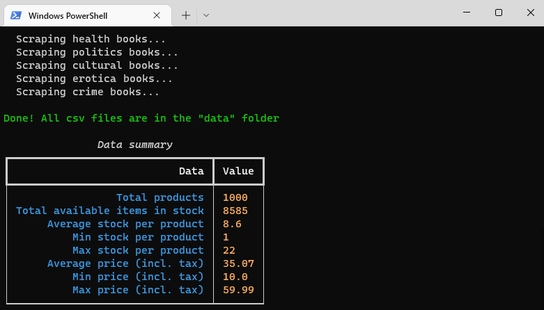

# Scrapbooks

Scrapbooks is a Python script for scraping a specific online books shop, made while studying python.

## Installation

### Python installation:
If you don't have python installed, download and install python from here : https://www.python.org/downloads/

### Get the files
If you have git :
```bash
git clone https://github.com/phi-lemon/scrapbooks.git
```
If you don't have git, download the files (click the green "Code" button > "Download ZIP").
Unzip all the files in a folder of your choice.

### Script installation
Create a virtual environnement, activate it (type the right command for windows or linux/mac) and install the packages.  
Open a terminal, go in the folder where you downloaded the project files e.g. ```cd scrapbooks``` 
and type the folowing commands :
```bash
python -m venv venv
venv\Scripts\activate  # on windows
source venv/bin/activate  # on linux
pip install -r requirements.txt
```

## Usage

Open a terminal, go in the folder where you downloaded the project files e.g. ```cd scrapbooks```
and type the folowing commands to run the script :

### On windows

```bash
venv\Scripts\activate 
python main.py
```

### On mac or linux

```bash
source venv/bin/activate
python main.py
```

If you need to interrupt the script, press **CTRL + C**

Screenshot:



## License
[MIT](https://github.com/phi-lemon/scrapbooks/blob/main/LICENSE.md)
